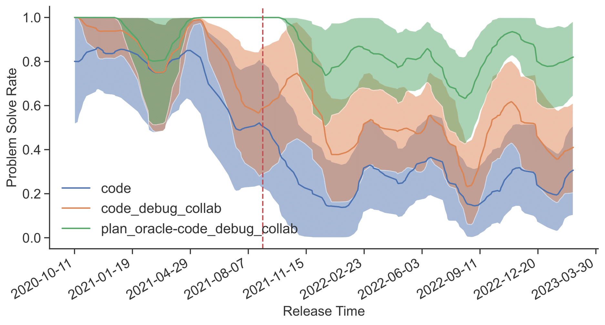

[](https://www.python.org/downloads/release/python-3100/)
[](LICENSE)
[](https://arxiv.org/abs/2308.01285)

# 🌊 Flows: Building Blocks of Reasoning and Collaborating AI

This repository contains the data and the infrastructure for executing the experimental setup on competitive coding described in the paper <a href="assets/flows_paper.pdf">Flows: Building Blocks of Reasoning and Collaborating AI</a> (<a href="https://arxiv.org/abs/2308.01285">arXiv</a>). Additionally, the structure of the repository is general and aims to serve as a useful template for conducting reproducible studies on structured interactions involving humans, tools, and AI systems efficiently, using the [aiFlows](https://github.com/epfl-dlab/aiflows/) library. The Flows used in the experiments are available in the <a href="https://huggingface.co/aiflows/CCFlows">CCFlows</a> repository on the FlowVerse.

For details about the Codeforces dataset and how it was constructed, the experimental setup, and the provided infrastructure, please refer to the paper.

**If you found the provided resources useful, please consider citing our work.**<br>

```
@misc{josifoski2023flows,
      title={Flows: Building Blocks of Reasoning and Collaborating AI},
      author={Martin Josifoski and Lars Klein and Maxime Peyrard and Yifei Li and Saibo Geng and Julian Paul Schnitzler and Yuxing Yao and Jiheng Wei and Debjit Paul and Robert West},
      year={2023},
      eprint={2308.01285},
      archivePrefix={arXiv},
      primaryClass={cs.AI}
}
```

---
## 1. The Idea and the Repository in a Nutshell
The paper proposes the abstraction of Flows that greatly simplifies the design and implementation of complex (work)Flows involving humans, AI systems, and tools. <a href="www.github.com/epfl-dlab/aiflows>**aiFlows**</a> is a Python library that implements the Flows abstraction and other infrastructure that aims to support researchers and developers in designing, implementing, evaluating, and sharing Flows of arbitrary complexity.

The paper demonstrates the potential of the Flows abstraction by conducting a detailed study of various Flows on the challenging task of competitive coding. The following figure illustrates the Flows used in the experiments (implemented <a href="https://huggingface.co/aiflows/CCFlows">here</a>):

<p align="center">
  
<p>

Here is a "teaser" of the results:

<p align="center">
  
<p>

In a nutshell, our evaluation suggests that:
- Data contamination **must** be accounted for when evaluating reasoning and collaboration patterns
- Flows have a lot of potential: the best performing AI-only Flows add +$21$, and human--AI Flows add +$54$ absolute points in terms of solve rate
- Previously proposed patterns do not necessarily generalize (c.f., paper), and further research is needed.
For more details, please refer to the paper.

With problems published before and after the training cutoff date, covering a broad spectrum of difficulty, the proposed dataset offers a unique opportunity to systematically evaluate structured interactions and LLMs more generally. Considering that directly attempting the solution with GPT-4 does not reach a solve rate of 30% even on (novel) entry-level problems, it suggests that this task is far from solved. Overall, We believe that our evaluation setup is one of the most thorough ones for evaluating structured interactions and will be very useful for the community on its own.

## 2. Environment Setup

With the repository cloned, we recommend creating a new [conda](https://docs.conda.io/en/latest/) virtual environment:
```bash
conda create -n cc_flows python=3.10
conda activate cc_flows
```

and installing the required packages using pip:
```bash
pip install -r pip_requirements.txt
```

## 3. Datasets' README

### Codeforces

- `id`: (String) Concatenation of the contest ID and the problem name -- a unique identifier.
- `id_hash`: (String) A checksum of all data in the problem. Cleaning steps and better scraping will not change the ID but should update the id_hash.
- `contest`: (int) A unique numeric identifier referring to the contest id.
- `problem_name`: (String) The name of the problem -- not guaranteed to be a unique identifier
- `problem_fullname`: (String) The verbose name of the problem.
- `problem_url`: (String) A URL to the problem page.
- `solution_url`: (String) A URL to the scraped working solution.
- `working_solution`: (String) A working solution in Python.
- `solutions`: (List[Dict]):
  - `verdict`: (String) The verdict of the submission according to the online judge.
  - `language`: (String) The programming language of the submission.
  - `URL`: (String) A URL to the submission.
  - `code`: (String) The code of the submission.
- `header`: (String) A string containing (unstructured) time & memory limits. Should be parsed a bit better (not necessary at the moment).
- `problem_description`: (List[str]) The problem description (the part after the title but before the input and output description). Each paragraph in the description is an entry in the list.
- `input_description`: (List[str]) The content of the input description block of the full problem description.
- `ouput_description`: (List[str]) The content of the input description block of the full problem description.
- `public_test_io`: (List [(List[str], str)]) A list of input-output pairs corresponding to the (full) example test cases. The input is given as a list of lines; the output is one string.
- `public_test_individual_io`: (List [(List[List[str]], str)] | None) A list of input-output pairs corresponding to the individual tests in the (full) example test cases. The outer list contains pairs of (list of individual tests, output string). Each individual test contains a list of string inputs. When fed with one of the individual strings, the program will generate output, which must occur as a continuous sequence of the output string. If it is not possible to recognize from the formatting that the test could be split into individual tests, then this is None.
- `hidden_test_io`: (List [(List[str], str)]) A list of (non-truncated) input-output pairs corresponding to the hidden test cases. The input is given as a list of lines; the output is one string.
- `hidden_tests_io_truncated`: (List [(List[str], str)]) A list of input-output pairs corresponding to the hidden test cases for which the full input cannot be scrapped (it is truncated).
- `non_unique_output`: (Bool) A flag suggesting whether the problem description allows for any of multiple solutions. The local evaluation does not support this fully and could lead to false negatives.
- `note`: (String | None) The explanation section that is usually (but not always) given at the end of the problem page.
- `difficulty`: (int) Numeric value reflecting the problem difficulty.
- `tags`: (List[str]) A list of tags characterizing the problem.
- `test_io`: (List[(List[str], str)]) A list of input-output pairs corresponding to the hidden test cases.
- `release_time`: ("before_cutoff" | "around_cutoff" | "after_cutoff") A string describing the time at which the problem was released.

### CCOutputs

The format of the outputs is a consequence of what is written to the file during inference.

Here is a list of the data fields paired with a description:
- `id`: (str) A unique identifier for the problem. The format is {contest_id}_{problem_name}.
- `inference_outputs`: (List[OutputMessage]) A list of OutputMessages, each corresponding to a single independent run, containing the code in the output_data dictionary of the data field associated with the OutputMessage.
- `error`: (str) "None" if the flow run successfully terminated for all independent samples, and the error message otherwise.

### Code Evaluators' output per problem

- `id`: (str) A unique identifier for the problem.
- `local_evaluator` | `online_judge`: (List[dict]): A list of evaluation outputs per candidate solution:
  - `evaluation_status`: ("submitted" | "completed" | "failed submission" | "failed collection") Applies only to online judges. Equals to `submitted` if the verdict from the online judge is still not available, equals to `completed` if the verdict has already been retrieved, and equals to `failed submission` if the submission or `failed collection` if the collection of the verdict failed.
  - `submission_url`: (str) Applies only to online judges. Added for successfully submitted candidate solutions.
  - `compilation_status`: (Boolean) True if the code compiles, False otherwise.
  - `compilation_error_message`: (String | None) The string representation of the exception in case of compilation error, and None otherwise.
  - `timeout_error`: (Boolean) True if a timeout error has occurred during the evaluation. It applies only to the local judges, which are used in debugging at inference time.
  - `hidden_tests_results`: (List[Dict]): A list of dictionaries containing the results of the evaluation on the hidden tests.
    - `status`: (Boolean) True if the code passes the test, False otherwise.
    - `input`: (String) The expected input to the code.
    - `expected_output`: (String) The expected output of the test.
    - `generated_output`: (String) The standard output of the code on the test input, None if an exception occurs.
    - `error_message`: (String | None) The string representation of the exception in case of an execution error, and None otherwise.
  - `public_tests_results`: (List[Dict])
    - `status`: (Boolean) True if the code passes the test, False otherwise.
    - `input`: (String) The expected input to the code.
    - `expected_output`: (String) The expected output of the test.
    - `generated_output`: (String) The standard output of the code on the test input, None if an exception occurs.
    - `error_message`: (String | None) The string representation of the exception in case of an execution error, and None otherwise.


## 4. Inference, Evaluation & Metric Calculation

### Inference
First, make sure that you have set up the API information in `configs/local/defaul.yaml` following the example. If you to see detailed information of what is going on in the background, set `FLOWS_VERBOSITY=debug` in your environment.

Each experiment is associated with a Hydra configuration file that is sufficient for reproducing the results. For instance, to run the inference for the <code>code_debug</code> Flow (c.f., paper) on the Codeforces dataset (pre- and post-cutoff) run:
```
CONFIG_ID=cf-code_debug # see the other options in the configs/experiment/inference/gpt4/ folder
python run_inference.py +experiment=inference/gpt4/$CONFIG_ID prefix=v1-- fault_tolerant_mode=True logger=wandb
```
The outputs will be logged to [Weights and Biases](https://wandb.ai/site).

### Evaluation

Once you have executed the inference, take note of the WandB run identifier and run the evaluation. Here is an example evaluation call:
```
WANDB_RUN_PATH=<the wandb run path of the inference run; should be in the format entity/project_name/run_id>
python run_evaluation.py +experiment=evaluation/codeforces_local_evaluator wandb_run_path=$WANDB_RUN_PATH logger=wandb
```

The evaluation results will be logged both in a separate WandB run corresponding to the evaluation run and in the inference run.

### Compute Metrics

Finally, we compute the metrics for the run. Here is an example call:

```
# calculate the problem solve rate and construct CI by bootstrap resampling
python run_metrics_calculation.py +experiment/metrics_calculation=[solve_rate, _bootstrap] code_evaluator_id=local_evaluator wandb_run_path=martinj96/GPTeam/2dutgthc logger=wandb

# calculates the solve rate per bucket according to a specific bucketing schema given in the config; construct CI by bootstrap resampling for each bucket
python run_metrics_calculation.py +experiment/metrics_calculation=[solve_rate,_bootstrap,_bucketing_codeforces_before_and_after_cutoff_chatgpt] code_evaluator_id=local_evaluator wandb_run_path=martinj96/GPTeam/2dutgthc logger=wandb

# Note 1: each of the previous calls appends results to the already existing results dictionary (or creates a new one if the results dictionary doesn't exist yet)
# Note 2: two bucketing schemas shouldn't be used in the same run, as the results will be overwritten

# intended usage: first run the metric calculation without bucketing; then run with potentially multiple bucketing schemas separately; repeat the procedure on both the public and the hidden test cases
```

## 5. (Bonus) Experiment Launchers

For your convenience, we are also sharing launchers that run the inference, evaluation, and metrics calculation in a single call and batch launchers that can run multiple experiments in a single call.

### Example runs
```
# Batch launcher that executes all of the experiments (CF and temporal; see scripts/) in the paper
bash scripts/batch_launcher_final_cf.sh false

# End-to-end launcher that runs a single end2end experiment run
bash scripts/end2end_launcher.sh --exp-prefix v1-- --config-inference "inference/gpt4/cf-code" --configs-evaluation "evaluation/codeforces_local_evaluator" --config-metrics-calculation "solve_rate" --bucketings-to-consider "_bucketing_codeforces_before_and_after_cutoff_chatgpt" --bucket-debug-k "2" --n-independent-samples "1" --show-command-output --logger "wandb" --online-eval-retries "3" --inference-overrides "fault_tolerant_mode=True"

# Evaluation and metrics
WANDB_RUN_PATH=<the wandb run path of the inference run; should be in the format entity/project_name/run_id>
bash scripts/eval_and_metrics_launcher.sh --wandb-run-path $WANDB_RUN_PATH --configs-evaluation "evaluation/codeforces_local_evaluator" --config-metrics-calculation "solve_rate" --bucketings-to-consider "_bucketing_codeforces_before_and_after_cutoff_chatgpt" --logger "wandb" --online-judge-verdicts-collection-delay "60"  --compute-performance-on-hidden-test-cases "true" --compute-performance-on-public-test-cases "false" --online-eval-retries "3"
```

**<ins>Suggested Experiment Launching Workflow</ins>**

1. Verify the experiment config from your IDE of choice
2. Start an experiment (or experiments) in the dry run mode by executing `bash scripts/batch_launcher.sh | less`
   - **verify that the config(s) printed in the console** match expectations
3. Start an experiment (or experiments) by executing `bash scripts/batch_launcher.sh | tee temp.txt`
   - from the console output **verify that the predictions and the parsing for the first few examples match expectation**
   - verify that the run & the logs are correctly logged on WandB
4. Verify the potential errors and warnings (if any) in the logs

Note: We suggest that the experiments are run on a few datapoints by setting `debug=true` and `debug_k=3` (in the `batch_launcher.sh`) before running the full experiment.

---
### License
This project is licensed under the terms of the MIT license. The Codeforces dataset was scraped from <a href="https://codeforces.com/">Codeforces</a>; therefore, please make sure that you use it in accordance with their license and their Terms and Conditions.
